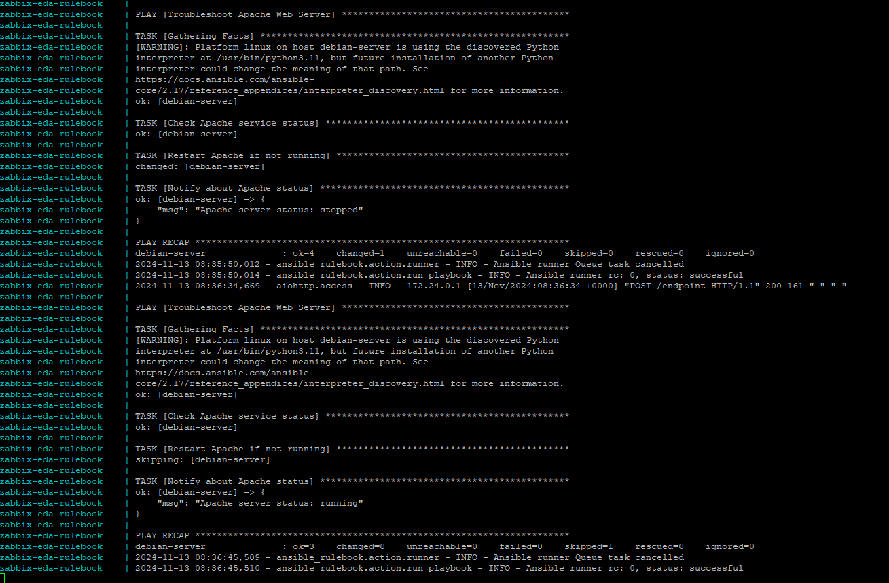

# zabbix-eda

Project for test Zabbix vs EDA server and ansible-rulebook



## Build and run Docker for create webhook

```console
docker build -t zabbix-eda-rulebook .

docker run --rm -p 5001:5001 zabbix-eda-rulebook

docker-compose up -d
Creating network "zabbix-eda_default" with the default driver
Creating zabbix-eda-rulebook ... done

docker-compose logs -f
...

docker-compose down
Stopping zabbix-eda-rulebook ... done
Removing zabbix-eda-rulebook ... done
Removing network zabbix-eda_default
```